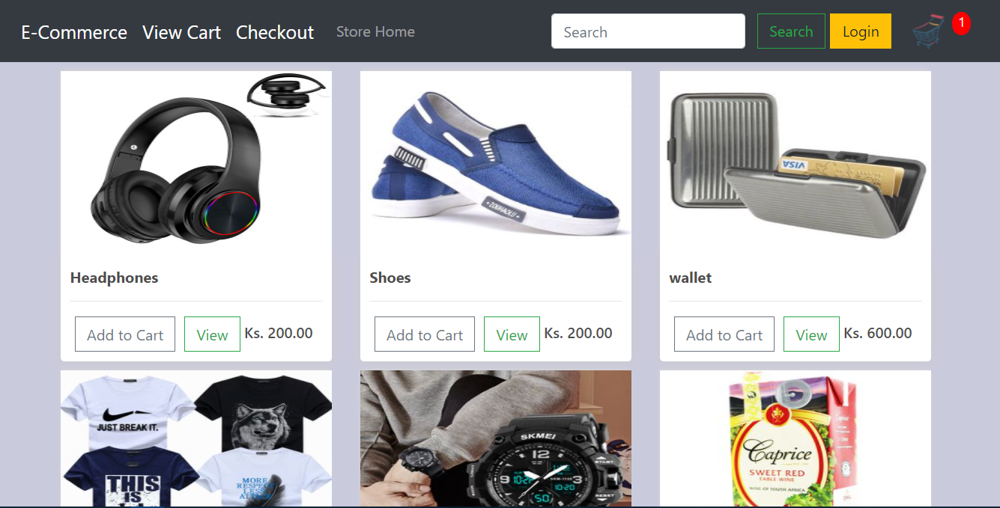
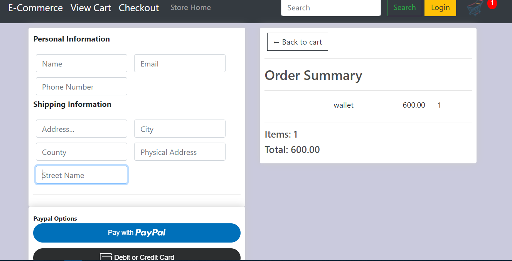

# Django-E-commerce-Website
This is an E-commerce website built in Python Django framework

### To launch it in your computer you will need to have Django and Python installed in your machine alongside other packages
## Setup

1. Git Clone the project with: ```https://github.com/George-Kibe/Django-E-commerce-Website.git```.

2. Move to the base directory: ```cd Django-E-commerce-Website```

3. Create a new python virtual environment with: ```python -m venv env```.

4. Activate enveronment with: ```env\Scripts\activate``` on windows, or ```source env/bin/activate``` on Mac and Linux.

5. Make migrations with: ```python manage.py makemigrations``` and then ```python manage.py migrate```.

6. Run app localy with: ```python manage.py runserver```.
7. if you get some errors, you may need to install some additional dependancies outlined in the error(s)

### View of user interface
## Home


## Checkout

testing bot
testing bot
## test push for legalzard bot on 29th January
testing bot
